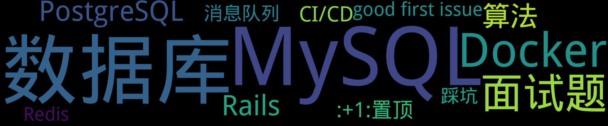

    
    
    
    
    
    
    

    

## 置顶 :thumbsup: 
- [基于Github Action自动生成并更新GitHub Issue博客的ReadMe](https://github.com/iamtomas/note/issues/1)  0 :speech_balloon:  	 
## 最新 :new: 

#### [消息队列零散知识笔记](https://github.com/iamtomas/note/issues/17) 0 :speech_balloon: 	 2022-01-11 03:59:18

:label: : [面试题](https://github.com/iamtomas/ghiblog/labels/%E9%9D%A2%E8%AF%95%E9%A2%98), [消息队列](https://github.com/iamtomas/ghiblog/labels/%E6%B6%88%E6%81%AF%E9%98%9F%E5%88%97)

## 如何保证消息的可靠性传输？或者说，如何处理消息丢失的问题？

[更多>>>](https://github.com/iamtomas/note/issues/17)

---

#### [GitLab CI/CD 实践](https://github.com/iamtomas/note/issues/16) 0 :speech_balloon: 	 2022-01-10 15:08:02

:label: : [CI/CD](https://github.com/iamtomas/ghiblog/labels/CI/CD)

在如今人人都卷的时代，当然是要花最少的时间干最多的事。检验学习成果当然是实践出真知，但在此之前先看看工作流与基本概念

---

#### [Redis零散知识笔记](https://github.com/iamtomas/note/issues/15) 0 :speech_balloon: 	 2022-01-09 16:02:17

:label: : [面试题](https://github.com/iamtomas/ghiblog/labels/%E9%9D%A2%E8%AF%95%E9%A2%98), [Redis](https://github.com/iamtomas/ghiblog/labels/Redis)

## 为什么这么快

1.  基于内存
2. 结构简单
3. 采用单线程
4. 使用多路I/O复用模型，非阻塞IO

## 支持的数据类型

1. string 字符串
2. Hash 哈希
3. List 列表
Redis的lpush+brpop命令可实现阻塞队列，比如生产

[更多>>>](https://github.com/iamtomas/note/issues/15)

---

#### [MySQL零散知识笔记](https://github.com/iamtomas/note/issues/14) 0 :speech_balloon: 	 2022-01-09 11:23:51

:label: : [MySQL](https://github.com/iamtomas/ghiblog/labels/MySQL), [面试题](https://github.com/iamtomas/ghiblog/labels/%E9%9D%A2%E8%AF%95%E9%A2%98)

## CPU飙升时如何排查与处理（MySQL）

1. top命令排查是否为mysqld占用导致的，否则找出其他占用高的进程进行处理
2. 若是mysqld导致的，则通过 `SHOW PROCESSLIST; ` 查看正在运行的进程中是否有消耗资源的SQL在运行
3. 如果存在高消耗的SQL

[更多>>>](https://github.com/iamtomas/note/issues/14)

---

#### [冒泡排序 - 排序算法](https://github.com/iamtomas/note/issues/13) 0 :speech_balloon: 	 2022-01-06 16:07:40

:label: : [算法](https://github.com/iamtomas/ghiblog/labels/%E7%AE%97%E6%B3%95)

## 基本思想

两两比较相邻记录的关键字，如果是反序则交换，直到没有反序为止

## 特性

---

## 分类  :card_file_box: 

    

        
        
:cloud: 词云 :cloud: 点击词云展开详细分类:point_down: 

    

:+1:置顶	1:newspaper:

- [基于Github Action自动生成并更新GitHub Issue博客的ReadMe](https://github.com/iamtomas/note/issues/1)  0 :speech_balloon:  	 

:framed_picture:封面	0:newspaper:

CI/CD	1:newspaper:

- [GitLab CI/CD 实践](https://github.com/iamtomas/note/issues/16)  0 :speech_balloon:  	 

good first issue	1:newspaper:

- [基于Github Action自动生成并更新GitHub Issue博客的ReadMe](https://github.com/iamtomas/note/issues/1)  0 :speech_balloon:  	 

MySQL	4:newspaper:

- [MySQL零散知识笔记](https://github.com/iamtomas/note/issues/14)  0 :speech_balloon:  	 
- [一条SQL更新语句是如何执行的？](https://github.com/iamtomas/note/issues/12)  0 :speech_balloon:  	 
- [MySQL中InnoDB记录与页结构](https://github.com/iamtomas/note/issues/10)  0 :speech_balloon:  	 
- [一条SQL查询语句是如何执行的？](https://github.com/iamtomas/note/issues/8)  0 :speech_balloon:  	 

Rails	1:newspaper:

- [Rails7 demo](https://github.com/iamtomas/note/issues/11)  0 :speech_balloon:  	 

Redis	1:newspaper:

- [Redis零散知识笔记](https://github.com/iamtomas/note/issues/15)  0 :speech_balloon:  	 

开源	0:newspaper:

技术栈	0:newspaper:

数据库	3:newspaper:

- [一条SQL更新语句是如何执行的？](https://github.com/iamtomas/note/issues/12)  0 :speech_balloon:  	 
- [MySQL中InnoDB记录与页结构](https://github.com/iamtomas/note/issues/10)  0 :speech_balloon:  	 
- [一条SQL查询语句是如何执行的？](https://github.com/iamtomas/note/issues/8)  0 :speech_balloon:  	 

消息队列	1:newspaper:

- [消息队列零散知识笔记](https://github.com/iamtomas/note/issues/17)  0 :speech_balloon:  	 

算法	2:newspaper:

- [冒泡排序 - 排序算法](https://github.com/iamtomas/note/issues/13)  0 :speech_balloon:  	 
- [两数之和 - 力扣（LeetCode）](https://github.com/iamtomas/note/issues/9)  0 :speech_balloon:  	 

面试题	3:newspaper:

- [消息队列零散知识笔记](https://github.com/iamtomas/note/issues/17)  0 :speech_balloon:  	 
- [Redis零散知识笔记](https://github.com/iamtomas/note/issues/15)  0 :speech_balloon:  	 
- [MySQL零散知识笔记](https://github.com/iamtomas/note/issues/14)  0 :speech_balloon:  	 

    
